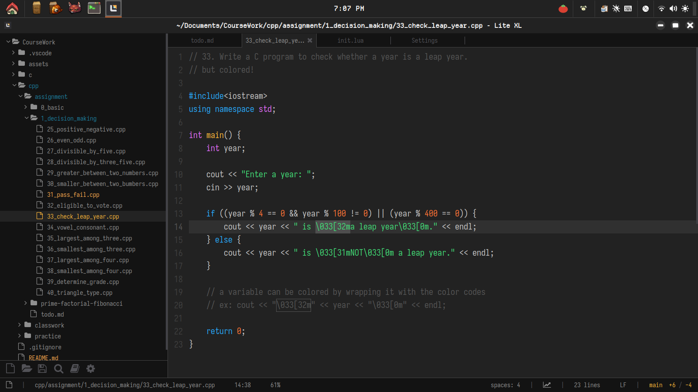
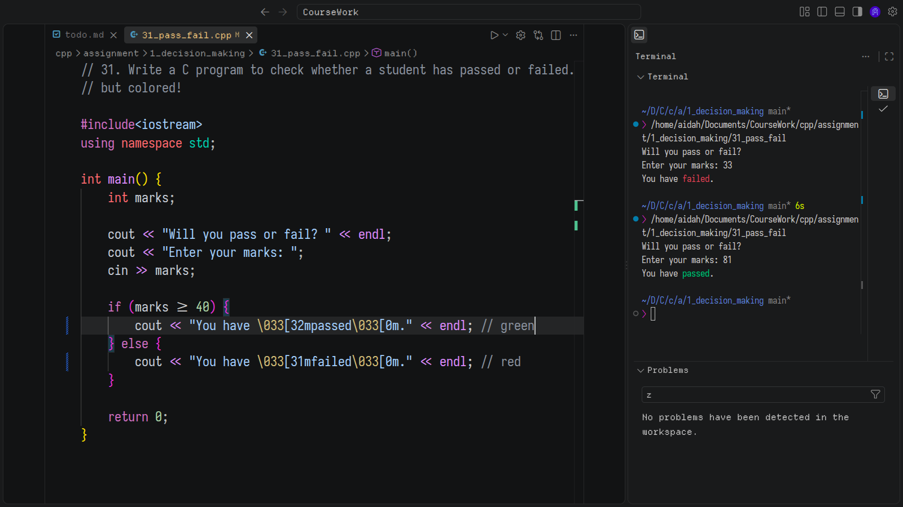
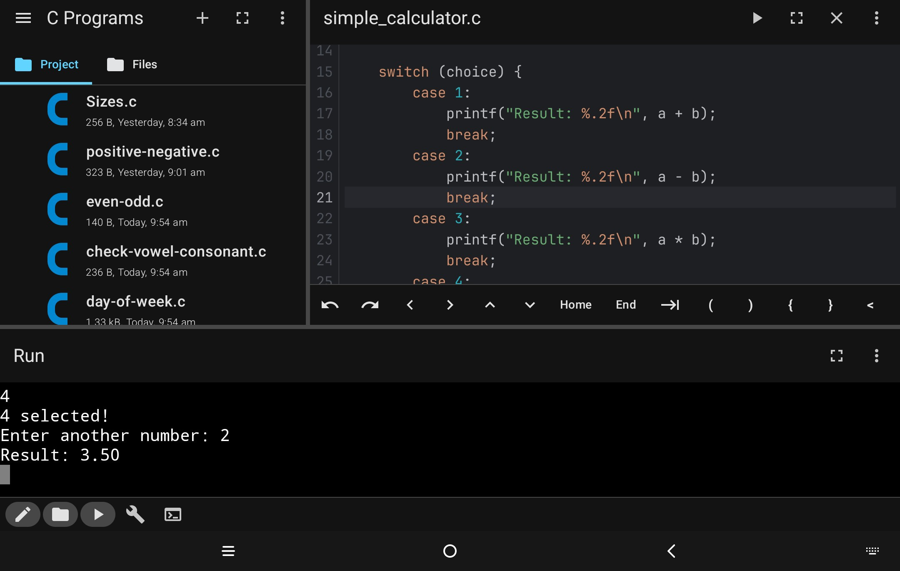

 

# CourseWork
This repo holds my University Course Assignments and personal C practice codes.

***

### Preferred IDEs:

- [Lite-xl](https://github.com/lite-xl/lite-xl)

- [VSCodium](https://github.com/vscodium/vscodium)

- CxStudio (Android)

***

### Commit Message Conventions
- `cpp:` - C++ programs
- `c:` - C programs
- `CW:` - Classwork

***

**Started learning C on:** 10 May 2026 (⁠｡⁠•̀⁠ᴗ⁠-⁠)⁠✧
